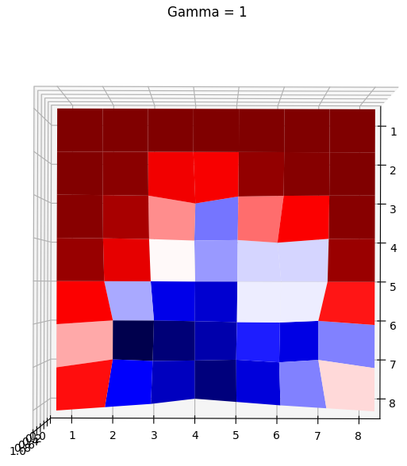
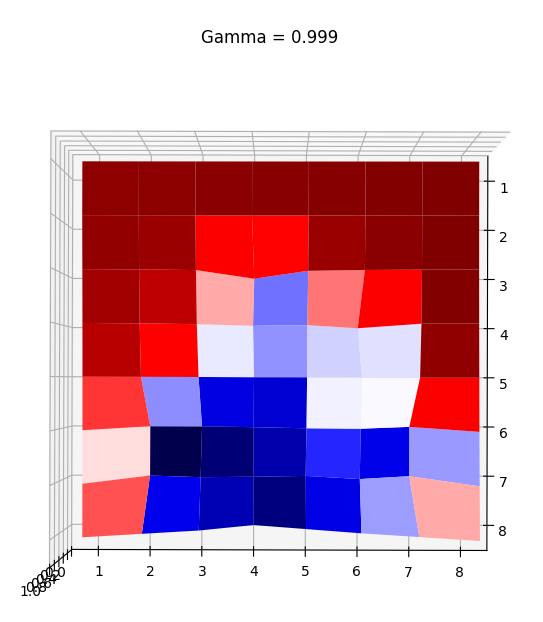
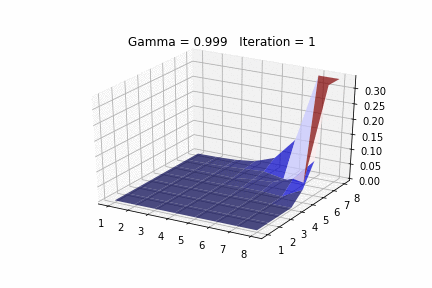
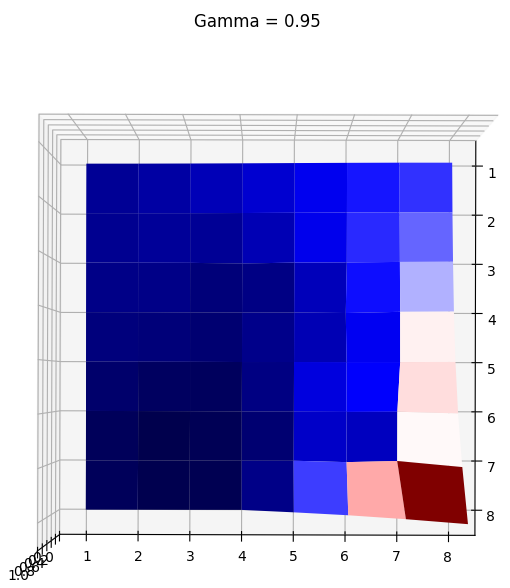
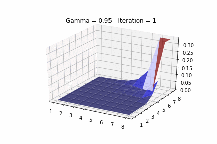

State Value Iteration For FrozenLake8x8-v0
------------------------------------

State Value Iteration assumes that the MDP is known and then in sweeps it will update the value for each state given the possible actions, future rewards, and state transition probabilities.  The variable gamma will affect how much long term rewards are considered when updating state values.

Here are some images showing state values after convergence, I modified the value of the final state [8,8] to be the max of all value states so that the graph looks nicer.  All terminal states have zero value.

Gamma 1
-------

Gamma 0.999
-------

Gamma 0.95
-------

